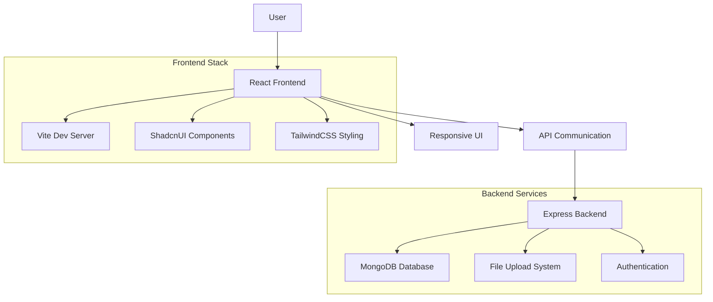

# 🎯 Lost & Found Web Portal
**Digital Community Platform for University Students**

[](https://reactjs.org/)
[](https://www.typescriptlang.org/)
[](https://vitejs.dev/)
[](https://tailwindcss.com/)
[](https://ui.shadcn.com/)
[](https://www.mongodb.com/)

---

## 📖 Table of Contents
- [🎯 Overview](#-overview)
- [✨ Features](#-features)
- [🏗️ Architecture](#-architecture)
- [🚀 Quick Start](#-quick-start)
- [📁 Project Structure](#-project-structure)
- [🔧 Configuration](#-configuration)
- [🛠️ Development](#-development)
- [📱 Screenshots](#-screenshots)
- [🚀 Deployment](#-deployment)
- [🔍 API Documentation](#-api-documentation)
- [🤝 Contributing](#-contributing)
- [📄 License](#-license)

---

## 🎯 Overview

Lost & Found Web Portal is a modern, intuitive digital platform designed specifically for university students to report lost items, find recovered belongings, and reconnect with their possessions quickly and efficiently. Built with cutting-edge web technologies, it provides a seamless experience for the entire university community.

### 🎯 Problem We Solve
- **Scattered lost item reports** across different platforms and physical boards
- **Lack of centralized system** for tracking lost and found items on campus
- **Difficulty in item identification** without proper documentation
- **Poor communication** between finders and owners
- **No organized verification process** for item claims

### 💡 Our Solution
A comprehensive platform that provides:
- **Digital item reporting** with photo documentation
- **Smart search capabilities** with advanced filtering
- **Secure verification process** for rightful ownership
- **Real-time notifications** for matches and updates
- **Community-driven** lost and found ecosystem

---

## ✨ Features

### 📱 Core Functionality
- **Report Lost Items** - Upload photos, descriptions, and location details
- **Report Found Items** - Document discovered items with verification details
- **Advanced Search** - Filter by category, location, date, and attributes
- **Smart Matching** - AI-powered suggestions for potential matches
- **Secure Claims** - Verification process to ensure rightful ownership

### 🔐 User Management
- **Student Authentication** - University email verification
- **Profile Management** - Personal information and contact details
- **Activity History** - Track all reported and claimed items
- **Reputation System** - Build trust within the community

### 🔔 Communication & Notifications
- **Real-time Alerts** - Instant notifications for potential matches
- **In-app Messaging** - Secure communication between users
- **Email Notifications** - Keep users updated on important activities
- **Status Updates** - Track item status from lost to found to claimed

### 🛡️ Security & Privacy
- **Data Protection** - Secure handling of personal information
- **Verification Process** - Multi-step claim verification
- **Privacy Controls** - Choose what information to share
- **Report System** - Flag inappropriate content or suspicious activity

### 📊 Analytics & Insights
- **Success Rate Tracking** - Monitor successful reunifications
- **Campus Insights** - Popular lost item categories and locations
- **User Statistics** - Community engagement metrics
- **Trend Analysis** - Identify patterns in lost items

---

## 🏗️ Architecture



### 🧩 Technology Stack

| **Category** | **Technology** | **Purpose** |
|-------------|---------------|-------------|
| **Frontend** | React 18.3.1, TypeScript 5.5.3 | Modern web application framework |
| **Build Tool** | Vite 5.4.1 | Fast development and build tool |
| **Styling** | TailwindCSS 3.4.11 | Utility-first CSS framework |
| **UI Components** | Shadcn/ui, Radix UI | Accessible and customizable components |
| **Routing** | React Router DOM 6.26.2 | Client-side routing |
| **State Management** | React Query 5.56.2 | Server state management |
| **Backend** | Express.js, Node.js | RESTful API server |
| **Database** | MongoDB | Document-based data storage |
| **Authentication** | JWT | Secure user authentication |
| **File Handling** | Multer | Image upload and processing |

---

## 🚀 Quick Start

### 📋 Prerequisites
- **Node.js** 18+ and npm/yarn
- **MongoDB** database (local or cloud)
- **Git** for version control

### ⚡ Installation

1. **Clone the repository**
   ```bash
   git clone https://github.com/Huzaifanasir95/Lost-Found-Web-Portal-for-University-Students.git
   cd Lost-Found-Web-Portal-for-University-Students
   ```

2. **Frontend Setup**
   ```bash
   # Install frontend dependencies
   npm install
   
   # Start development server
   npm run dev
   ```
   The frontend will be available at `http://localhost:8080`

3. **Backend Setup**
   ```bash
   # Navigate to backend directory
   cd backend
   
   # Install backend dependencies
   npm install
   
   # Set up environment variables
   cp .env.example .env
   ```
   
   Edit `.env` with your configuration:
   ```env
   # Server configuration
   PORT=5000
   NODE_ENV=development
   
   # JWT Secret
   JWT_SECRET=your_jwt_secret_key_here
   
   # MongoDB connection
   MONGODB_URI=mongodb://localhost:27017/lost-found-db
   ```

4. **Start the backend server**
   ```bash
   npm run dev
   ```
   The backend API will be available at `http://localhost:5000`

5. **Access the application**
   Open [http://localhost:8080](http://localhost:8080) in your browser

---

## 📁 Project Structure

```
Lost-Found-Web-Portal-for-University-Students/
│
├── 📁 backend/                    # Express.js backend
│   ├── .env                      # Environment variables
│   ├── uploads/                  # Uploaded images storage
│   │   ├── image-1741932787957-279132930.png
│   │   ├── image-1741932857511-917659108.png
│   │   └── ...
│   └── [API routes and controllers]
│
├── 📁 public/                    # Static assets
│   ├── favicon.ico
│   ├── og-image.png
│   └── placeholder.svg
│
├── 📁 src/                      # React application source
│   ├── 📁 components/           # React components
│   │   ├── Features.tsx         # Features showcase
│   │   ├── Footer.tsx           # Footer component
│   │   ├── Hero.tsx             # Hero section
│   │   ├── ItemCard.tsx         # Item display card
│   │   ├── Navigation.tsx       # Navigation bar
│   │   ├── Stats.tsx            # Statistics display
│   │   └── 📁 ui/               # Shadcn/ui components
│   │       ├── button.tsx
│   │       ├── card.tsx
│   │       ├── dialog.tsx
│   │       ├── input.tsx
│   │       └── [40+ UI components]
│   │
│   ├── 📁 hooks/                # Custom React hooks
│   │   ├── use-mobile.tsx       # Mobile detection
│   │   └── use-toast.ts         # Toast notifications
│   │
│   ├── 📁 lib/                  # Utility libraries
│   │   └── utils.ts             # Common utilities
│   │
│   ├── 📁 pages/                # Page components
│   │   ├── FoundItems.tsx       # Found items listing
│   │   ├── Index.tsx            # Home page
│   │   ├── ItemDetail.tsx       # Item detail view
│   │   ├── LostItems.tsx        # Lost items listing
│   │   └── NotFound.tsx         # 404 error page
│   │
│   ├── App.tsx                  # Main application component
│   ├── main.tsx                 # Application entry point
│   └── index.css                # Global styles
│
├── components.json              # Shadcn/ui configuration
├── eslint.config.js            # ESLint configuration
├── index.html                  # HTML template
├── package.json                # Dependencies and scripts
├── postcss.config.js           # PostCSS configuration
├── tailwind.config.ts          # TailwindCSS configuration
├── tsconfig.json               # TypeScript configuration
├── vite.config.ts              # Vite configuration
└── README.md                   # This file
```

---

## 🔧 Configuration

### 🌍 Environment Variables

| **Variable** | **Description** | **Required** | **Example** |
|-------------|----------------|-------------|-------------|
| `PORT` | Backend server port | ✅ | `5000` |
| `NODE_ENV` | Environment mode | ✅ | `development` |
| `JWT_SECRET` | JWT signing secret | ✅ | `your_jwt_secret_key_here` |
| `MONGODB_URI` | MongoDB connection string | ✅ | `mongodb://localhost:27017/lost-found-db` |

### 🗄️ Database Setup

1. **Install MongoDB** locally or use MongoDB Atlas
2. **Create database**: `lost-found-db`
3. **Collections** will be auto-created:
   - `users` - User profiles and authentication
   - `lostitems` - Lost item reports
   - `founditems` - Found item reports
   - `claims` - Claim requests and verifications
4. **Indexes** for optimized queries on location, category, and date

---

## 🛠️ Development

### 📝 Available Scripts

```bash
# Frontend Development
npm run dev              # Start development server with hot reload
npm run build            # Build for production
npm run build:dev        # Build for development
npm run lint             # Run ESLint
npm run preview          # Preview production build

# Backend Development (in /backend directory)
npm run dev              # Start backend server with nodemon
npm run start            # Start production server
npm test                 # Run backend tests
```

### 🏗️ Development Workflow

1. **Feature Development**
   ```bash
   git checkout -b feature/your-feature-name
   # Make your changes
   npm run lint
   npm run build
   git commit -m "feat: add your feature"
   git push origin feature/your-feature-name
   ```

2. **Code Quality**
   - TypeScript for type safety
   - ESLint for code quality
   - Prettier for consistent formatting
   - Component-based architecture

3. **Testing Strategy**
   - Unit tests for utilities and hooks
   - Integration tests for API endpoints
   - E2E tests for critical user flows

### 🎨 UI Development

- **Shadcn/ui components** for consistent design
- **TailwindCSS** for rapid styling
- **Responsive design** for all device sizes
- **Dark/Light mode** support
- **Accessibility** features built-in

---

## 📱 Screenshots

### 🏠 Home Page
- Hero section with call-to-action
- Feature highlights
- Community statistics
- Quick search functionality

### 📝 Report Item
- Image upload with preview
- Detailed form with validation
- Location and category selection
- Privacy settings

### 🔍 Search & Browse
- Advanced filtering options
- Grid and list view modes
- Sorting capabilities
- Pagination for large datasets

### 💬 Item Details
- Comprehensive item information
- Contact options for claims
- Verification process
- Related item suggestions

---

## 🚀 Deployment

### ☁️ Frontend Deployment (Vercel/Netlify)

1. **Build the application**
   ```bash
   npm run build
   ```

2. **Deploy to Vercel**
   ```bash
   npm install -g vercel
   vercel
   ```

3. **Environment Variables**
   - Set `VITE_API_URL` to your backend URL
   - Configure other environment variables

### 🖥️ Backend Deployment (Railway/Heroku)

1. **Prepare for deployment**
   ```bash
   # Ensure all dependencies are listed
   npm audit fix
   ```

2. **Set environment variables** on your hosting platform

3. **Deploy** using your platform's CLI or Git integration

### 🐳 Docker Deployment

```dockerfile
# Frontend Dockerfile
FROM node:18-alpine
WORKDIR /app
COPY package*.json ./
RUN npm install
COPY . .
RUN npm run build
EXPOSE 8080
CMD ["npm", "run", "preview"]
```

---

## 🔍 API Documentation

### 📡 Backend Endpoints

| **Endpoint** | **Method** | **Description** | **Auth Required** |
|-------------|-----------|----------------|------------------|
| `/api/auth/register` | POST | User registration | ❌ |
| `/api/auth/login` | POST | User login | ❌ |
| `/api/items/lost` | GET | Get lost items | ❌ |
| `/api/items/lost` | POST | Report lost item | ✅ |
| `/api/items/found` | GET | Get found items | ❌ |
| `/api/items/found` | POST | Report found item | ✅ |
| `/api/items/:id` | GET | Get item details | ❌ |
| `/api/items/:id/claim` | POST | Claim an item | ✅ |
| `/api/upload` | POST | Upload item images | ✅ |

### 📝 Request/Response Examples

#### Report Lost Item
```http
POST /api/items/lost
Authorization: Bearer <jwt-token>
Content-Type: multipart/form-data

{
  "title": "MacBook Pro 16-inch",
  "description": "Silver MacBook Pro with university stickers",
  "category": "Electronics",
  "location": "Library 3rd Floor",
  "dateLastSeen": "2025-08-01",
  "images": [<file-uploads>]
}
```

```json
{
  "success": true,
  "data": {
    "id": "64f8a1b2c3d4e5f6789012ab",
    "title": "MacBook Pro 16-inch",
    "status": "active",
    "createdAt": "2025-08-03T10:30:00Z"
  }
}
```

---

## 🤝 Contributing

### 🌟 How to Contribute

1. **Fork the repository**
2. **Create a feature branch**
   ```bash
   git checkout -b feature/amazing-feature
   ```
3. **Make your changes**
4. **Run tests and linting**
   ```bash
   npm run lint
   npm run build
   ```
5. **Commit your changes**
   ```bash
   git commit -m 'feat: add amazing feature'
   ```
6. **Push to the branch**
   ```bash
   git push origin feature/amazing-feature
   ```
7. **Open a Pull Request**

### 📋 Contribution Guidelines

- Follow the existing code style and patterns
- Add tests for new features
- Update documentation as needed
- Use conventional commit messages
- Ensure all checks pass before submitting PR

### 🐛 Bug Reports

Please use the GitHub issue tracker to report bugs. Include:
- Description of the issue
- Steps to reproduce
- Expected vs actual behavior
- Screenshots if applicable
- Environment details (browser, OS, etc.)

### 💡 Feature Requests

We welcome feature requests! Please open an issue with:
- Clear description of the feature
- Use case and benefits for university students
- Proposed implementation approach
- Any relevant mockups or examples

---

## 📄 License

This project is licensed under the MIT License - see the [LICENSE](LICENSE) file for details.

---

## 📞 Support

- **GitHub Issues**: [Report bugs or request features](https://github.com/Huzaifanasir95/Lost-Found-Web-Portal-for-University-Students/issues)
- **Email**: Contact the development team for urgent issues
- **Documentation**: Check the project wiki for detailed guides

---

## 🙏 Acknowledgments

- **React Team** for the amazing framework
- **Vite** for blazing fast development experience
- **Shadcn/ui** for beautiful, accessible components
- **TailwindCSS** for rapid UI development
- **MongoDB** for flexible data storage
- **University Community** for feedback and testing

---

*Connecting university students with their lost belongings through technology*
